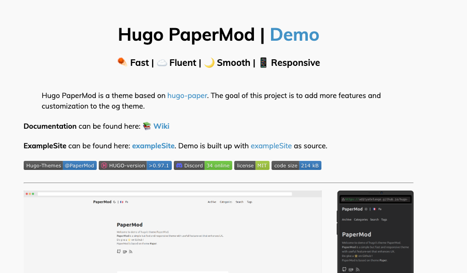
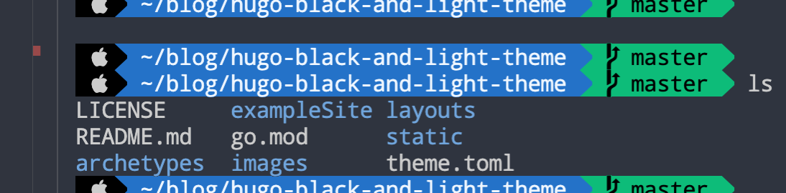
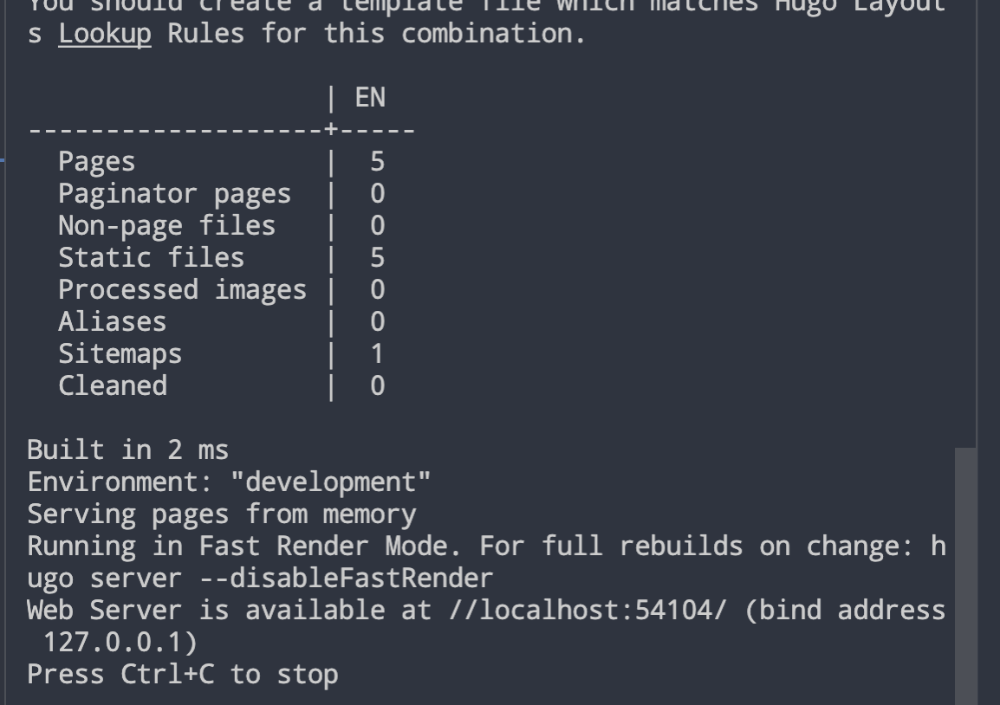
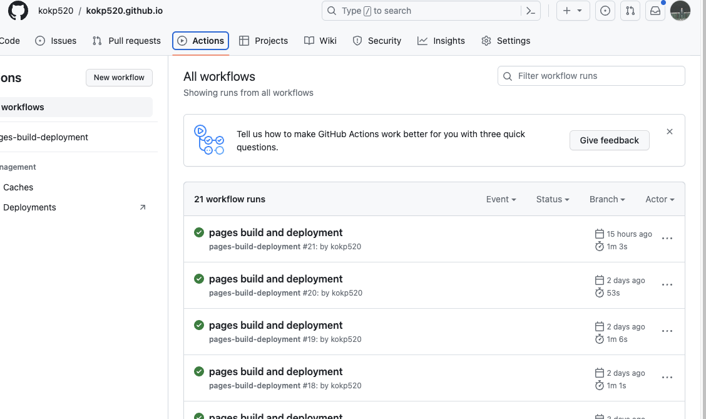

# 如何建立個人靜態網站 - Hugo


**_教學要怎麼建立自己的 hugo 靜態網站 + github.io_**

<!--more-->

## 如何建立 hugo 個人靜態網站



### Hugo installation

由於我個人是屬於 Mac 使用者，所以就跟 window 使用者說抱歉了～ 😲<br>

```bash
brew install hugo
```



執行`hugo --version`，如果有出現版本，代表成功安裝。



### Create local file

```bash
hugo new site myWebsite
```

<br>
你會看到資料夾內多了myWebsite的檔案
<br>

```bash
/
├── archetypes
├── assets
├── content
├── data
├── layouts
├── resources
├── static
├── public
├── themes
├── hugo.html
```

☝️ 架構與作用會類似長得像這樣 ☝️ <br>



- **`archetypes`** - 默認的文件，Hugo 會根據這裡的模型來生成內容
- **`assets`** - hugo 資源文件，像是 scss/sass,typescript 等，hugo 會將他們編譯成靜態資源
- **`content`** - 網站的內容頁面，也就是你的文章。
- **`data`** - 網站會需要的數據，像是 json,yaml,toml
- **`layouts`** - hugo 模板文件，決定內容如何編譯成 html，像是你的首頁
- **`resoutces`** - hugo 處理後的資源文件
- **`static`** - 靜態文件圖片，會直接複製到 public
- **`public`** - hugo 生成的整個網站輸出目錄。 github.io 就要存放在這裡
- **`theme`** - 主題
- **`hugo.html`** - website 設定檔
  

<br>

簡單來說，hugo 根據`content` and `data` 生成頁面，`layout`控制渲染，`assets` and `resources`處理資源，`public`輸出文件目錄。

### Theme

hugo 本身有建立許多主題的分享<br>
我個人是會把主題的作者附在個人的網站上，尊重每個創作者！<br>

可以從這裡下載 - [hugo theme](https://themes.gohugo.io/)


點擊喜歡的主題後你會看到有 Download
大部分的主題也都會有 Demo，挑自己喜歡的就可以了。



點擊`demo`的超連結就可以了



**通常每個主題內部都會在教學如何安裝，可能會有些許不同。<br>如果有遇到問題可以到該主題的 github 觀看！**



- 關於`git`的指令我之後再寫一篇文章講解

在你下載的主題之中會有`exampleSite`，把他複製下來貼到有`go.mod`那一頁。



或是你可以直接把你需要的`exampleSite/content, static等`出來讓模板渲染他，這些都只是範例但你可以依照自己想法去慢慢編輯。<br>
<br>\* **(畢竟刪除比加法簡單)**

### 開啟 local server

接下來你可以在有`go.mod`那一頁執行<br>

```bash
hugo server
```

<br>



這邊的`localhost:54104` 可以直接按者**Ctrl+左鍵**點擊他<br>
就可以看到妳美美的網站了!<br>
再去你的`設定檔`以及`content/posts`內部慢慢上傳貼文了～

### 發佈到 github

首先我個人會在 github 建立兩個 repo，一個存放靜態網頁，一個存放自己的文件內容。<br>

---

先假設你是在`~/`中執行，

```bash
# 創立兩個資料夾
mkdir myWebsite # 這邊會存放有著go.mod的內容 也就是上方做的資料
mkdir public # 這邊把靜態檔案跟主檔案切開
```

- **Step 1** - 在 github 上建立兩個 repo，一個叫做 myWebsite(這邊沒有特別指定名稱)，第二個必須要叫做`github帳號.github.io`，github Page 才會讀取你的靜態網頁。
- **Step 2** - 在有 go.mod 的專案底下

```bash
cd ~/myWebsite

git init
git remote add origin https://github.com/帳號/網站專案名稱
git add .
git commit -m 'create project'
git push origin main
```

- **Step 3** - 在`public`，執行

```bash
cd ~/public
git init
git remote add origin https://github.com/帳號/帳號.github.io
git add .
git commit -m 'create github page'
git push origin main
```

- **Step 4** - 再回到有 go.mod 的頁面
  建立一個捷徑到你的 myWebsite

```bash
#複製你的public絕對路徑  以我的mac舉例
ln -s /home/user/public /home/user/myWebsite
```

- **Step 5** - 回到 myWebsite 後執行`hugo`

```bash
cd ~/myWebsite;
hugo; # 這時會建立靜態檔案到public裡

#回到public push 到github就完成了

cd ~/public
git add .
git ci -m 'add static website'
git push origin main
```

---

恭喜你完成部署自己的網站！<br>
再來就到`https://帳號.github.io`就可以看到你的個人網站了


部署會需要一些時間，想知道 CI/CD 發生什麼事，可以到 github.io 的 repo 點擊 action 就可以看到<br>





### 建立貼文

有人問我說要怎麼創建貼文，只要到你的`myWebsite/content/posts/`創建 postName/index.md

### hackMD

**md 是什麼？**<br>

這已經不是本文章的內容了在這邊分享一些連結 😆

---

**[Markdown 語法大全](https://hackmd.io/@eMP9zQQ0Qt6I8Uqp2Vqy6w/SyiOheL5N/%2FBVqowKshRH246Q7UDyodFA?type=book)**


**[hackmd 練習](https://hackmd.io/)<br>**
👆 可以在這邊創建帳號，就可以直接寫 markdown 且執行展示給你看！<br>


---

### CI/CD Script tool

另外分享個執行部屬的腳本

```go
package main

import (
	"fmt"
	"os"
	"os/exec"
	"path/filepath"
)

func main() {
    // 設定 Hugo 專案目錄的路徑
    hugoProjectPath := "你的public的絕對路徑"

    hugoPath := "有go.mod的那個repo路徑"

    	// ----- website content -----

	// 執行 Git 命令
	if err := executeCommands(hugoPath, "git", "add", "."); err != nil {
		fmt.Println("Git add 失敗:", err)
		return
	}

	if err := executeCommands(hugoPath, "git", "commit", "-m", "update new post"); err != nil {
		fmt.Println("Git commit 失敗:", err)
		return
	}

	if err := executeCommands(hugoPath, "git", "push"); err != nil {
		fmt.Println("Git push 失敗:", err)
		return
	}

	fmt.Println("hugo path完成！")

	// ---- public -----

    // 執行 Hugo 命令
    if err := executeCommand(hugoPath, "hugo"); err != nil {
        fmt.Println("Hugo 執行失敗:", err)
        return
    }

    // 執行 Git 命令
    if err := executeCommands(hugoProjectPath, "git", "add", "."); err != nil {
        fmt.Println("Git add 失敗:", err)
        return
    }

    if err := executeCommands(hugoProjectPath, "git", "commit", "-m", "update"); err != nil {
        fmt.Println("Git commit 失敗:", err)
        return
    }

    if err := executeCommands(hugoProjectPath, "git", "push"); err != nil {
        fmt.Println("Git push 失敗:", err)
        return
    }

    fmt.Println("完成！")
}

func executeCommand(dir, command string, args ...string) error {
    cmd := exec.Command(command, args...)
    cmd.Dir = dir
    cmd.Stdout = os.Stdout
    cmd.Stderr = os.Stderr
    return cmd.Run()
}

func executeCommands(dir, command string, args ...string) error {
    cmd := exec.Command(command, args...)
    cmd.Dir = dir
    cmd.Stdout = os.Stdout
    cmd.Stderr = os.Stderr
    return cmd.Run()
}

func getAbsolutePath(relativePath string) (string, error) {
    absPath, err := filepath.Abs(relativePath)
    if err != nil {
        return "", err
    }
    return absPath, nil
}
```

執行方法

```bash t
# 我個人是放在有go.mod的那個目錄創建bin資料夾，把上面的code放在裡面
go run bin/cicd_script.go
```

就可以瞜！

## 調整網頁細項



comming soon...


