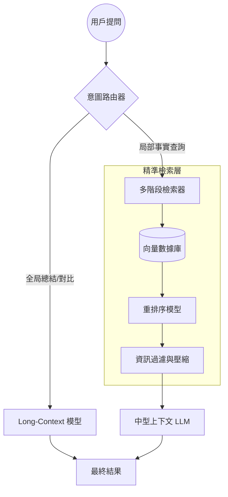

# 超越長文本：深度解析 RAG 與 Long-Context LLM 的架構博弈、融合與生產級優化


在大型語言模型（LLM）的演進歷程中，上下文窗口（Context Window）的持續擴張無疑是最令人矚目的趨勢之一。從最初的 4k、8k，到後來的 128k (GPT-4 Turbo)、1M 甚至 2M (Gemini 1.5 Pro)，模型處理海量資訊的能力似乎正以前所未有的速度增長。這引發了技術圈的一個激烈爭論：**當模型可以直接「閱讀」整本書甚至整個程式碼庫時，我們還需要檢索增強生成（RAG）嗎？**

作為 AI 工程師，我們必須看透行銷數字背後的技術本質。本文將從系統架構、成本效率、資訊密度以及檢索精度等多個維度，深度解析 RAG 與 Long-Context LLM 之間的博弈關係，並探討兩者在生產環境中的最優融合路徑。

<!--more-->

## 1. 核心技術原理：注意力機制與檢索的本質差異

要理解這兩者的爭論，首先要理解它們處理資訊的方式有何本質不同。

### 1.1 Long-Context LLM：全量注意力的極致
Long-Context 模型本質上是透過優化位置編碼（如 RoPE 的線性縮放或 NTK-aware 縮放）以及注意力機制（如 FlashAttention-2、Ring Attention）來擴展模型所能處理的 Token 長度。
*   **優點**：模型具備「全局視野」，能夠在整個上下文中捕捉長距離依賴關係，這在複雜的推理、總結與跨段落對比中表現優異。
*   **缺點**：計算開銷隨長度呈二次方（或透過優化後呈線性）增長。最致命的是「大海撈針」（Needle In A Haystack）問題——即使上下文窗口夠大，模型仍可能在中間段落遺失關鍵資訊（Lost in the Middle）。

### 1.2 RAG：精準定位的過濾器
RAG 則是一種「分而治之」的策略。它透過外部向量數據庫或全文檢索引擎，將海量數據切片，僅將與問題最相關的 K 個片段餵給 LLM。
*   **優點**：極致的成本效率，能夠處理理論上無限大的知識庫，且資訊更新速度快，無需重新訓練模型。
*   **缺點**：強烈依賴檢索品質。如果檢索器（Retriever）沒找到正確片段，即使 LLM 再強也無計可施。此外，RAG 很難處理需要全局掃描的「總結性」問題。

## 2. 深度博弈：為什麼 Long-Context 無法完全取代 RAG？

儘管 Gemini 1.5 Pro 展示了驚人的長文本處理能力，但在實際生產環境（Production Ready）中，RAG 依然是不可或缺的技術路徑。

### 2.1 經濟經濟學：Token 成本的降維打擊
在企業級應用中，推理成本是核心考量因素。
假設你有一個 100 萬 Token 的技術文檔庫：
*   **Long-Context 方案**：每次提問都要輸入 100 萬 Token。即使模型支持，單次對話的費用可能高達數十甚至上百美元。
*   **RAG 方案**：每次檢索僅提取 2,000 Token。成本是前者的 **1/500**。
對於高併發的用戶請求，Long-Context 在經濟上是不可持續的。

### 2.2 延遲（Latency）的挑戰
雖然擴展上下文的優化技術層出不窮，但處理 1M Token 的首字延遲（TTFT）依然遠高於處理 2k Token。在需要即時回應的對話式 AI 場景中，數十秒甚至分鐘級的等待會毀掉用戶體驗。

### 2.3 知識的即時性與動態擴展
RAG 系統可以透過更新向量數據庫在秒級完成知識更新。而對於 Long-Context 模型，雖然可以透過輸入新文檔來「學習」，但當數據規模達到 TB 級別時，將所有內容塞進上下文窗口既不現實也不經濟。

## 3. 架構演進：從競爭走向融合的「混合架構」

在 2026 年的 AI 工程實踐中，最先進的系統不再是在兩者中二選一，而是採用 **Long-Context Aware RAG**（長文本感知的 RAG）架構。

### 3.1 混合架構設計圖



### 3.2 關鍵技術組件：意圖路由 (Intent Routing)
透過一個輕量級的模型（或 Prompt 策略）判斷用戶問題的類型：
*   如果問題是：「A 產品在 2024 年的營收是多少？」，則路由至 **RAG 模式**。
*   如果問題是：「請分析這 50 份法律合同中關於違約責任條款的演變趨勢」，則路由至 **Long-Context 模式**。

## 4. 具體實作路徑：提升檢索精度與資訊密度

要在生產環境中落地這種架構，我們需要解決「如何餵給 LLM 最精華的資訊」的問題。

### 4.1 實作方向一：多階段檢索與重排序 (Re-ranking)
傳統向量搜索（Embedding）在處理長文本時容易丟失語義。引入一個 Cross-Encoder 架構的 Re-ranker（如 BGE-Reranker）可以極大提升資訊的精準度。

```python
# Python 範例：多階段檢索與重排序邏輯
from llama_index.core import VectorStoreIndex, QueryBundle
from llama_index.postprocessor.colbert_rerank import ColbertRerank

def professional_retrieval(query_str, documents):
    # 1. 粗排：向量檢索
    index = VectorStoreIndex.from_documents(documents)
    retriever = index.as_retriever(similarity_top_k=20)
    nodes = retriever.retrieve(query_str)
    
    # 2. 精排：使用重排序模型
    reranker = ColbertRerank(top_n=5)
    query_bundle = QueryBundle(query_str)
    ranked_nodes = reranker.postprocess_nodes(nodes, query_bundle)
    
    return ranked_nodes
```

### 4.2 實作方向二：Context Compression (上下文壓縮)
即使有長文本能力，也不代表我們要浪費它。透過 **LLMLingua** 等技術對檢索到的片段進行壓縮，在保留關鍵資訊的同時減少 Token 消耗，可以同時降低延遲與成本。

## 5. 未來趨勢：KV Cache 的共享與檢索的融合

隨著技術的發展，我們看到了一個有趣的趨勢：**RAG 正在變深，Long-Context 正在變快。**

1.  **動態 KV Cache 緩存**：未來的模型可能會將常用的外部知識庫預先處理成 KV Cache，在推理時直接「掛載」（Mount）到模型中，這模糊了檢索與內部權重之間的界限。
2.  **層級式注意力機制**：模型內部可能會內置檢索邏輯，只對與當前 Token 最相關的「歷史區塊」進行注意力計算，這在架構層面實現了 RAG 的原生化。

## 6. 專家洞察：如何選擇適合你的架構？

在實際項目中，我建議遵循以下決策樹：

1.  **數據規模 > 100MB 且更新頻繁？** -> 必須使用 RAG。
2.  **單次任務需要分析的文檔量 < 500k Token 且強調邏輯推理？** -> 優先使用 Long-Context。
3.  **預算受限且併發量高？** -> RAG 是唯一的生存之道。
4.  **對回答的忠實度要求極高（如法律、醫療）？** -> RAG 提供更好的源文檔溯源能力。

## 總結 (Summary)

Long-Context LLM 並非 RAG 的終結者，而是 RAG 的強大盟友。長文本能力提升了模型在獲取資訊後的「處理上限」，而 RAG 則決定了系統在面對海量知識時的「生存下限」。

在未來的 AI 應用中，最卓越的系統將會像人類大腦一樣運作：透過 RAG（長期記憶檢索）獲取相關片段，再將其放入 Long-Context（工作記憶/注意力中心）進行深度處理。這種「記憶與思考」的協同，才是通往真正通用人工智慧（AGI）的基石。

---

**關於作者**：
Adi Wu 是一位專注於 LLM 架構與大規模 AI 系統落地的技術專家。他致力於探索 RAG 與 Agentic Workflow 的前沿實踐，幫助企業在生成式 AI 的浪潮中構建高效、穩健的技術架構。
