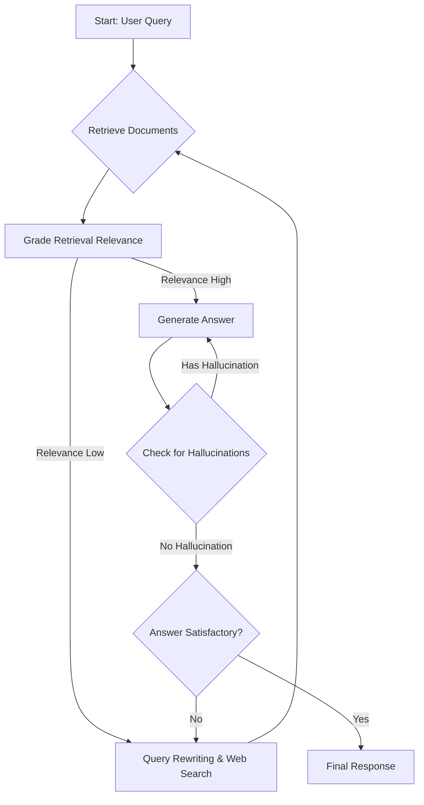

# 超越檢索：深度解析 Agentic RAG 的自我修正機制與實踐


在大型語言模型（LLM）的應用開發中，檢索增強生成（RAG）早已成為解決模型幻覺、引入私有知識的標配方案。然而，隨著企業級應用對準確性的要求從「看起來對」提升到「絕對精確」，傳統的「一站式」RAG 架構（Naive RAG）逐漸顯露疲態：檢索不到位、檢索內容無關、或是生成結果偏離事實，這些問題在複雜的推理任務中頻頻發生。

為了應對這些挑戰，**Agentic RAG（智能代理式 RAG）** 應運而生。它不再是一個線性的流水線，而是一個具備「自我意識」和「修正能力」的循環系統。本文將深度解析 Agentic RAG 的核心原理，並提供具體的實作架構與程式碼範例，帶你從傳統檢索跨越到主動推理的新紀元。

<!--more-->

## 1. 傳統 RAG 的困境：為什麼「檢索」不等於「知識」？

傳統 RAG 的工作流程通常是：`User Query -> Vector Search -> Retrieve Snippets -> LLM Generation`。這個過程是單向且脆弱的。

### 1.1 檢索品質的「黑盒」問題
在傳統 RAG 中，如果向量數據庫返回了不相關的片段（Noise），LLM 往往會試圖「硬掰」這些資訊，導致最終答案雖然流暢但事實錯誤。

### 1.2 缺乏反思機制
傳統架構無法判斷檢索到的內容是否足以回答問題。如果知識庫中根本沒有答案，Naive RAG 仍會強行生成，而非告知用戶「我不知道」或「我需要更多資訊」。

### 1.3 單次推理的侷限性
對於需要跨多個文檔、多個步驟才能解決的複雜問題，單次的檢索與生成完全無法處理資訊之間的邏輯依賴關係。

## 2. 什麼是 Agentic RAG？

Agentic RAG 的核心在於將 **Agent（代理人）** 的思維模式引入 RAG 流程。它賦予系統以下三種核心能力：

1.  **自我評估 (Self-Correction)**：系統能判斷檢索內容的相關性，並在不滿意時重新檢索。
2.  **多步規劃 (Multi-step Reasoning)**：將複雜問題拆解為多個子任務，逐步獲取知識。
3.  **工具調用 (Tool Use)**：不僅限於向量搜索，還能根據需要調用網路搜索、API 查詢或計算器。

### 2.1 Agentic RAG 的三層架構
- **感知層 (Perception)**：解析用戶意圖，決定是否需要檢索。
- **行動層 (Action)**：執行檢索、重寫查詢（Query Rewriting）、甚至切換檢索策略。
- **評估層 (Evaluation)**：對檢索結果和生成內容進行「打分」，決定是輸出答案還是回到上一步。

---

## 3. 核心機制：自我修正循環 (Self-RAG Loop)

一個典型的 Agentic RAG 系統（如 CRAG - Corrective RAG）通常包含以下關鍵邏輯節點：

### 3.1 檢索評分器 (Retrieval Grader)
當檢索器返回 K 個片段後，由一個專門的 LLM 擔任「裁判」，評估每個片段與問題的相關性。
- **Yes**：保留該片段。
- **No**：剔除，並判斷是否需要透過 Web Search 來補足缺失的知識。

### 3.2 幻覺檢查器 (Hallucination Grader)
在 LLM 生成初步答案後，系統會檢查答案中的每一個事實陳述，是否都能在檢索到的片段中找到依據。這能有效過濾掉模型「腦補」的內容。

### 3.3 答案有效性檢查 (Answer Grader)
最後，系統評估生成的答案是否真正回答了用戶最初的問題。如果沒有，則重新進入規劃階段，調整檢索方向。

---

## 4. 實作方向：基於 Python 與 LangGraph 的 Agentic RAG

目前實作 Agentic RAG 最流行的框架是 **LangGraph**，因為它能完美表達「圖（Graph）」狀的循環邏輯。

### 4.1 系統架構圖 (Mermaid)



### 4.2 Python 程式碼實作示範

以下是一個簡化的 Agentic RAG 核心邏輯實現，展示如何使用條件邊（Conditional Edges）來控制流程：

```python
import operator
from typing import Annotated, List, TypedDict
from langchain_openai import ChatOpenAI
from langgraph.graph import StateGraph, END

# 定義系統狀態
class AgentState(TypedDict):
    question: str
    documents: List[str]
    generation: str
    iteration_count: int

# 1. 檢索節點 (Mock Retrieval)
def retrieve(state: AgentState):
    print("---RETRIEVING---")
    # 這裡串接你的 Vector DB (如 Pinecone, Milvus)
    return {"documents": ["這是從數據庫檢索到的關鍵片段..."], "iteration_count": state.get("iteration_count", 0) + 1}

# 2. 生成節點
def generate(state: AgentState):
    print("---GENERATING---")
    llm = ChatOpenAI(model="gpt-4o")
    # 根據 documents 生成答案
    res = llm.invoke(f"基於以下內容回答問題: {state['documents']}\n問題: {state['question']}")
    return {"generation": res.content}

# 3. 評估邊邏輯 (Conditional Edge)
def grade_documents(state: AgentState):
    print("---CHECKING RELEVANCE---")
    # 這裡可以用一個較小的模型來快速打分
    # 假設我們簡單判斷，如果迭代次數太少且內容不夠，就去搜索
    if "關鍵" in state["documents"][0] or state["iteration_count"] > 2:
        return "generate"
    else:
        return "web_search"

# 4. 網路搜索節點
def web_search(state: AgentState):
    print("---WEB SEARCHING---")
    # 模擬搜索結果
    return {"documents": ["這是從網路上獲取的最新資訊..."]}

# 構建圖
workflow = StateGraph(AgentState)

workflow.add_node("retrieve", retrieve)
workflow.add_node("generate", generate)
workflow.add_node("web_search", web_search)

workflow.set_entry_point("retrieve")
workflow.add_conditional_edges(
    "retrieve",
    grade_documents,
    {
        "generate": "generate",
        "web_search": "web_search",
    },
)
workflow.add_edge("web_search", "retrieve")
workflow.add_edge("generate", END)

app = workflow.compile()

# 執行
inputs = {"question": "2026 年最流行的 AI 技術是什麼？"}
for output in app.stream(inputs):
    print(output)
```

### 4.3 為什麼選擇這套架構？
- **狀態管理**：`AgentState` 允許我們追蹤迭代次數，防止陷入死循環。
- **模組化**：檢索、打分、生成都是獨立的 Node，便於單獨優化（例如使用不同的模型）。
- **可視化**：LangGraph 的圖結構讓複雜的 AI 邏輯變得清晰可追蹤。

---

## 5. Agentic RAG 的實戰優化建議

要打造一個生產級的 Agentic RAG，僅有循環是不夠的，還需要以下深層優化：

### 5.1 查詢重寫 (Query Rewriting) 的藝術
用戶的原始問題往往不適合直接檢索。Agent 應該具備將「模糊提問」轉化為「精確搜索關鍵字」的能力。例如，將「昨天的比賽怎樣？」重寫為「2026 年 5 月 5 日 NBA 總決賽第一場比分與技術統計」。

### 5.2 使用 Small Models 進行評估
為了降低延遲，評估層（Grader）不一定要使用 GPT-4 或 Gemini 1.5 Pro。使用經過微調的 Llama-3-8B 或 Mistral 可以大幅提升打分速度，並將大模型留給最後的生成任務。

### 5.3 混合檢索 (Hybrid Search) 的強化
Agent 應該能決定何時使用 **向量檢索 (Vector Search)** 尋找語義，何時使用 **關鍵字檢索 (BM25)** 尋找精確名詞。這種決策過程是 Agentic RAG 相比傳統 RAG 的巨大優勢。

---

## 6. 未來趨勢：從單體 Agent 到多代理協作 (Multi-Agent RAG)

隨著任務複雜度的提升，單一 Agent 可能難以負荷。未來的方向是 **專業分工**：
- **檢索專家 Agent**：專精於優化檢索路徑和處理異構數據。
- **事實核查 Agent**：專門負責對照原始文檔進行幻覺檢測。
- **總結專家 Agent**：負責將各路資訊整合為優雅的文字。

這種多代理協作模式將使 RAG 系統的穩定性達到前所未有的高度。

---

## 7. 總結 (Summary)

Agentic RAG 代表了 AI 應用從「自動化」向「自主化」的轉變。透過引入 **自我評估、動態路徑選擇和循環修正**，我們解決了傳統 RAG 難以應對的準確性與邏輯性問題。

雖然這套架構帶來了更高的延遲（因為需要多次模型調用）和更高的 Token 成本，但在對數據精度有著苛刻要求的金融、醫療、法律等專業領域，這種付出是絕對值得的。對於開發者而言，掌握 LangGraph 或 AutoGen 等框架，將是構建下一代 AI 原生應用的關鍵技能。

超越檢索，讓 AI 學會思考與自省，這正是 Agentic RAG 為我們開啟的未來。
