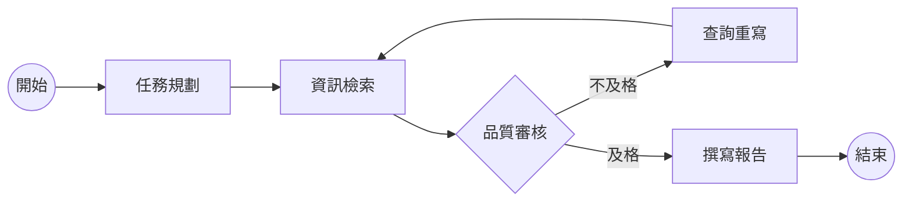

# 自動化研究的新境界：深度解析多代理協作架構 (Multi-Agent Workflows) 與 LangGraph 實作


在過去的一年中，生成式 AI 的應用範式正在經歷一場深刻的變革。我們從最初的「提示工程 (Prompt Engineering)」過渡到了「檢索增強生成 (RAG)」，而現在，我們正站在「代理式工作流 (Agentic Workflows)」的浪尖。單一的 LLM 調用已經無法滿足複雜的業務邏輯，未來的 AI 應用將是由多個具備專門技能的 AI 代理 (Agents) 組成的協作網絡。

本文將深度探討多代理協作架構的設計哲學，並以 **LangGraph** 為例，展示如何構建一個具備規劃、執行、反思與自我修正能力的自動化研究系統。

<!--more-->

## 1. 為什麼單一 Agent 不夠？代理式工作流的興起

當我們向一個全能的大型語言模型（如 GPT-4 或 Claude 3.5）提出複雜任務時，模型往往需要在一個單次的推理過程中完成理解、檢索、分析、生成與校對。這種「一步到位」的方式雖然快速，但在面對精確度要求高或步驟繁瑣的任務時，極易出現邏輯斷裂或事實幻覺。

### 1.1 系統一與系統二思維
根據諾貝爾獎得主 Daniel Kahneman 的理論，人類思維分為直覺式的「系統一」與邏輯推理式的「系統二」。傳統的單次 Prompt 觸發更像系統一，而 **Agentic Workflows** 則是試圖在 LLM 之上構建系統二。透過將任務拆解，讓模型在每一步都有機會進行觀察、思考與行動 (ReAct)，大幅提升了複雜任務的成功率。

### 1.2 多代理協作的必要性
在軟體工程中，我們講求「單一職責原則 (Single Responsibility Principle)」。同樣地，在 AI 系統設計中，一個專門負責「網頁檢索」的 Agent 與一個專門負責「邏輯檢核」的 Agent 協作，其效果遠好於一個試圖完成所有事情的巨大 Agent。多代理架構不僅提高了模組化程度，更讓系統具備了更強的容錯性與可觀測性。

---

## 2. 多代理協作的核心模式

在設計多代理系統時，我們通常會根據任務結構選擇以下幾種模式：

### 2.1 協調者模式 (Orchestrator-Workers)
這是一個典型的中央集權架構。一個 **Router** 或 **Planner** Agent 負責接收用戶需求，並將其分發給不同的專門 Worker。Worker 完成後將結果回傳給協調者進行整合。
- **優點**：結構清晰，容易控制流程。
- **適用場景**：任務路徑相對固定，需要強一致性輸出的場景。

### 2.2 同儕協作模式 (Peer-to-Peer)
Agent 之間沒有明確的從屬關係，而是透過共享狀態空間進行協作。例如，一個寫作 Agent 寫完草稿後，直接將控制權移交給審核 Agent，審核 Agent 若不滿意則再移回寫作 Agent。
- **優點**：靈活性極高，適合需要多次迭代、反覆修正的任務。
- **適用場景**：創意寫作、程式碼開發與 Debug。

### 2.3 分層架構模式 (Hierarchical)
這是最複雜的架構，模仿企業組織圖。頂層 Agent 負責戰略規劃，中層 Agent 負責子專案管理，底層 Agent 負責具體執行。
- **優點**：能夠處理極大規模、跨領域的複雜任務。
- **適用場景**：自動化企業營運報告、跨學科科學研究。

---

## 3. LangGraph：為 AI 代理注入「圖」的靈魂

在實現這些協作模式時，傳統的線性框架（如 LangChain 的早期 Chains）顯得力不從心。因為現實中的 AI 工作流往往包含 **循環 (Cycles)**：當檢索結果不佳時需要重新檢索，當生成的程式碼錯誤時需要自我修正。

**LangGraph** 的出現填補了這個空白。它將 AI 工作流定義為一個 **有向圖 (Graph)**，其中：
- **Nodes (節點)**：代表具體的操作或 Agent 的思考過程（Python 函數）。
- **Edges (邊)**：定義了節點之間的轉向。
- **Conditional Edges (條件邊)**：根據上一步的輸出動態決定下一步去哪。
- **State (狀態)**：在圖中流轉的全域變數，所有節點共享此上下文。

### 3.1 LangGraph 的核心優勢
1.  **原生支持循環**：解決了 RAG 自我修正或 Agent 自我迭代的核心難題。
2.  **細粒度控制**：開發者可以精確定義何時停止、何時分支。
3.  **持久化與斷點 (Checkpointing)**：支持工作流的掛起與恢復，這對於「人機協作 (Human-in-the-loop)」至關重要。
4.  **可觀測性**：內建的狀態追蹤讓 Debug 變得直觀，你可以清楚看到 Agent 在哪個環節「走偏了」。

---

## 4. 實踐：構建一個「自動化深度研究系統」

讓我們設計一個具備自我反思能力的研究系統。該系統包含三個角色：
1.  **Planner (規劃者)**：拆解問題。
2.  **Researcher (研究員)**：執行搜索與數據收集。
3.  **Reviewer (審查員)**：評估數據質量，不合格則要求重新研究。

### 4.1 系統架構圖 (Mermaid)



### 4.2 Python 程式碼實作

以下展示如何使用 `langgraph` 與 `langchain` 實作上述邏輯：

```python
import operator
from typing import Annotated, List, TypedDict, Literal
from langchain_openai import ChatOpenAI
from langgraph.graph import StateGraph, END

# 1. 定義系統狀態 (State)
class ResearchState(TypedDict):
    topic: str
    plan: List[str]
    context: Annotated[List[str], operator.add]
    report: str
    is_satisfactory: bool

# 2. 定義節點 (Nodes)
llm = ChatOpenAI(model="gpt-4o", temperature=0)

def planner(state: ResearchState):
    print("---PLANNING---")
    res = llm.invoke(f"請針對主題 '{state['topic']}' 拆解出 3 個研究方向。")
    return {"plan": [res.content]}

def researcher(state: ResearchState):
    print("---RESEARCHING---")
    # 這裡實務上會呼叫 Tavily 或 Google Search API
    mock_info = f"找到關於 {state['plan'][-1]} 的相關數據..."
    return {"context": [mock_info]}

def reviewer(state: ResearchState):
    print("---REVIEWING---")
    # 邏輯判斷是否需要重新研究
    content_len = len("".join(state['context']))
    if content_len < 50:
        return {"is_satisfactory": False}
    return {"is_satisfactory": True}

def writer(state: ResearchState):
    print("---WRITING---")
    res = llm.invoke(f"根據以下資訊撰寫研究報告: {state['context']}")
    return {"report": res.content}

# 3. 定義邊界邏輯 (Conditional Edge)
def decide_to_research(state: ResearchState) -> Literal["researcher", "writer"]:
    if state["is_satisfactory"]:
        return "writer"
    return "researcher"

# 4. 構建圖 (Building the Graph)
workflow = StateGraph(ResearchState)

workflow.add_node("planner", planner)
workflow.add_node("researcher", researcher)
workflow.add_node("reviewer", reviewer)
workflow.add_node("writer", writer)

workflow.set_entry_point("planner")
workflow.add_edge("planner", "researcher")
workflow.add_edge("researcher", "reviewer")

workflow.add_conditional_edges(
    "reviewer",
    decide_to_research,
    {
        "researcher": "researcher",
        "writer": "writer"
    }
)
workflow.add_edge("writer", END)

# 編譯並運行
app = workflow.compile()
config = {"configurable": {"thread_id": "1"}}
inputs = {"topic": "2026 年邊緣運算 (Edge AI) 的發展趨勢"}

for output in app.stream(inputs, config):
    print(output)
```

### 4.3 核心技術點解析
- **`Annotated[List[str], operator.add]`**：這是 LangGraph 狀態管理的精髓。它告訴系統當多個節點返回 `context` 時，不要覆蓋，而是將其「累加」。這對於收集多個來源的資訊至關重要。
- **`add_conditional_edges`**：這是實現「反思機制」的關鍵。我們在這裡根據 `is_satisfactory` 狀態動態決定是回到搜索還是前進到撰寫階段。
- **`thread_id`**：這允許系統保存對話歷史，即使程式中斷重啟，Agent 也能記住之前發生了什麼。

---

## 5. 生產環境中的挑戰與解決方案

雖然多代理系統功能強大，但在實際落地時會面臨許多棘手問題：

### 5.1 無限循環的風險 (Infinite Loops)
如果 Agent A 總是對 Agent B 的結果不滿意，系統可能會陷入無窮迴圈，導致 Token 消耗劇增。
- **解決方案**：在 `State` 中加入 `max_iterations` 計數器，當達到上限時強制終止並回報錯誤。

### 5.2 延遲與成本 (Latency & Cost)
多代理協作意味著更多的 LLM 調用。一次複雜的研究任務可能需要 10-20 次 LLM 調用，延遲通常以分鐘計。
- **解決方案**：
    - **非對稱負載**：評估節點使用較小的模型（如 GPT-4o-mini 或 Llama-3-8B），核心生成使用大模型。
    - **並行執行**：利用 LangGraph 的 `Send` API，讓多個研究節點並行運行。

### 5.3 狀態漂移 (State Drift)
隨著圖的運行，Context 會越來越長，包含許多無關的中間步驟，導致模型注意力分散。
- **解決方案**：實施「狀態清理機制」，每經過一個重要階段就進行一次「資訊摘要 (Summarization)」，移除冗餘資訊。

---

## 6. 未來趨勢：邁向「自主進化的 Agent」

多代理架構的終極目標是 **Self-Evolving Agents**。目前的圖結構仍需人類開發者定義，但未來的 Agent 將具備以下能力：
1.  **動態圖構建**：Agent 根據任務難度，自主決定需要召喚哪些專家 Agent。
2.  **自我優化提示詞**：Agent 在協作過程中學會如何給其他 Agent 下達更清晰的指令。
3.  **長效記憶優化**：不僅記住當前任務，還能從過去數千次協作中總結出最佳實踐路徑。

---

## 7. 總結 (Summary)

從「單一 Prompt」到「代理式工作流」，我們正在見證 AI 從工具向夥伴的轉變。LangGraph 等框架的出現，讓開發者能夠像設計狀態機一樣設計 AI 邏輯，賦予了 AI 系統真正的推理與糾錯能力。

雖然這套架構在成本與延遲上仍有挑戰，但其帶來的魯棒性與解決複雜問題的能力，無疑是未來 AI 應用開發的主戰場。對於技術團隊而言，現在就應該開始嘗試將簡單的 RAG 升級為具備反思機制的 Agentic RAG，並在多代理協作中尋找業務價值的新增量。

AI 的未來不在於它能回答什麼，而在於它能為我們「完成」什麼。
