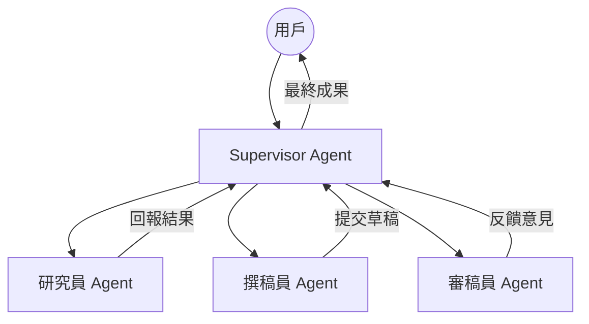

# 

MCP issues detected. Run /mcp list for status.title: "從單兵作戰到群體智能：深度解析 Multi-Agent Orchestration 的設計模式與實戰路徑"
subtitle: "探索 LLM Agent 的協作之道：從 ReAct 模式到複雜的 MAS 架構實踐"
date: 2026-05-06T14:30:00+08:00
lastmod: 2026-05-06T14:30:00+08:00
draft: false
author: "Adi Wu (AI Technical Expert)"
tags: ["LLM", "Multi-Agent", "Orchestration", "AI Engineering", "LangGraph", "AutoGen", "Swarm"]
categories: ["Tech", "AI"]
weight: 2
toc:
  enable: true

---

<!--more-->

在 2023 年，大語言模型（LLM）的突破讓我們驚嘆於「對話」的力量。到了 2024 年，我們開始談論 RAG 與 Function Calling。而進入 2026 年，AI 工程界的聖盃已經轉移到了 **Agentic Workflow** 與 **Multi-Agent Systems (MAS)**。我們不再滿足於讓 LLM 僅僅作為一個知識問答的窗口，而是希望將其構建為一個能夠自主規劃、使用工具、並在多個專業 Agent 之間協作以完成複雜任務的「數位勞動力」。

本文將深入探討 Multi-Agent Orchestration（多代理協作編排）的核心設計模式、目前主流的技術框架，以及如何在實際生產環境中構建具備高度魯棒性的 AI 協作系統。

## 為什麼需要 Multi-Agent？

單一 Agent (Single Agent) 在面對長鏈條、多步驟且跨領域的任務時，往往會遇到以下瓶頸：
1. **上下文壓力 (Context Saturation)**：隨著步驟增加，Prompt 會變得極其冗長，導致 LLM 對核心指令的注意力（Attention）分散。
2. **錯誤傳播 (Error Propagation)**：一旦在某個中間步驟產生幻覺（Hallucination），單一 Agent 很難跳出邏輯陷阱，容易導致整個鏈條失效。
3. **專業化程度不足**：一個試圖同時處理「代碼編寫」、「安全審計」與「部署配置」的 Agent，其效果往往不如三個分別專精於這些領域的 Agent 進行協作。

透過 MAS 架構，我們可以將複雜任務拆解為多個子任務，並讓不同的 Agent 扮演不同的角色（Role-playing），這不僅提升了成功率，更讓系統具備了「自我校正」的可能性。

## Multi-Agent 的核心協作模式

在設計多代理系統時，我們通常會採用以下幾種經典的協作模式：

### 1. 層級式協作 (Hierarchical Orchestration)
在這種模式下，會有一個「領班代理」（Supervisor Agent）負責統籌全局。它接收用戶的原始需求，進行任務規劃（Planning），然後將子任務分派給旗下的專業代理。



### 2. 鏈式/流水線協作 (Sequential/Pipeline)
任務按照預定的順序在 Agent 之間傳遞。前一個 Agent 的輸出（Output）直接作為後一個 Agent 的輸入（Input）。這種模式最適合標準化的業務流程（SOP）。

### 3. 同儕博弈與協作 (Joint Collaboration / Peer Review)
Agent 之間沒有明確的上下級關係，而是透過對話、爭論或反思（Reflection）來達成共識。這在複雜的代碼生成或科學發現中非常有效，例如讓「程式碼 Agent」與「測試 Agent」不斷循環，直到測試通過。

## 實踐路徑：從 OpenSource 框架看設計哲學

目前的開發者主要在以下幾種框架中做出選擇：

### OpenAI Swarm：輕量化與交接（Handoffs）
OpenAI Swarm 展示了一種極簡的設計哲學：Agent 僅由 `instructions` 與 `tools` 組成。最核心的概念是 **Handoff**，即一個工具可以返回另一個 Agent 的實例，實現控制權的移交。

### Microsoft AutoGen：高度靈活的對話模式
AutoGen 強調 Agent 之間的「Conversation」。它預設支持多輪對話，並允許 Agent 在對話中自動切換狀態。這對於需要深度博弈的場景非常強大，但相對的，其控制流較難預測。

### LangGraph：基於狀態機的精確控制
LangGraph 是目前企業級開發的首選。它將 Agentic Workflow 抽象為「圖（Graph）」，其中節點（Node）代表行為，邊（Edge）代表流轉邏輯。這種方式讓循環、條件分支和狀態持久化（Checkpoints）變得非常清晰。

## 實作案例：全自動技術報告生成系統

以下我們使用 Python 與虛擬的狀態機邏輯，展示如何實作一個具備「自動糾錯」機制的 Multi-Agent 系統。

```python
import os
from typing import TypedDict, List
from langgraph.graph import StateGraph, END

# 定義狀態
class AgentState(TypedDict):
    topic: str
    content: str
    feedback: str
    revision_count: int
    is_approved: bool

# 1. 研究節點
def researcher(state: AgentState):
    print(f"--- 正在針對 {state['topic']} 進行深入研究 ---")
    # 模擬 LLM 生成內容
    return {"content": f"關於 {state['topic']} 的深度研究報告內容..."}

# 2. 審查節點 (Critic)
def reviewer(state: AgentState):
    print("--- 正在進行內容品質審查 ---")
    content = state['content']
    if len(content) < 100:
        return {
            "feedback": "內容過於簡略，請增加更多實作細節。",
            "is_approved": False,
            "revision_count": state['revision_count'] + 1
        }
    return {"is_approved": True}

# 3. 修正節點
def editor(state: AgentState):
    print(f"--- 根據反饋進行修正 (第 {state['revision_count']} 次) ---")
    return {"content": state['content'] + "\n[已修正] 增加了更多技術架構圖與代碼範例。"}

# 構建圖
workflow = StateGraph(AgentState)

workflow.add_node("researcher", researcher)
workflow.add_node("reviewer", reviewer)
workflow.add_node("editor", editor)

workflow.set_entry_point("researcher")

# 定義條件邊
def should_continue(state: AgentState):
    if state["is_approved"] or state["revision_count"] > 3:
        return "end"
    return "continue"

workflow.add_edge("researcher", "reviewer")
workflow.add_conditional_edges(
    "reviewer",
    should_continue,
    {
        "continue": "editor",
        "end": END
    }
)
workflow.add_edge("editor", "reviewer")

app = workflow.compile()

# 執行系統
initial_state = {
    "topic": "Agentic RAG Optimization",
    "content": "",
    "feedback": "",
    "revision_count": 0,
    "is_approved": False
}
app.invoke(initial_state)
```

## 面臨的挑戰與解決方案

### 1. 代理死循環 (Agent Loop Death)
在 MAS 中，Agent 之間可能會陷入互相推諉或無限修正的循環。
- **對策**：引入 `revision_count` 閾值，以及一個「觀察者（Observer）」節點，負責在檢測到重複輸出時強行接入介入。

### 2. 延遲與成本
多代理意味著更多的 Token 消耗與更長的推理時間。
- **對策**：
    - **混合模型策略**：在 Reviewer 或 Router 節點使用較小、較快且便宜的模型（如 GPT-4o-mini 或 Claude Haiku），僅在核心內容生成節點使用頂級模型。
    - **並行執行 (Parallelization)**：在不需要順序依賴的步驟中，同時觸發多個子 Agent。

### 3. 狀態管理與溯源
當任務失敗時，很難追蹤是哪個 Agent 的哪一步出錯。
- **對策**：實施完整的 Traceability。利用 LangSmith 或自建的日誌系統，紀錄每一個節點的 Input/Output、Prompt 版本與思維鏈 (Chain-of-Thought)。

## 未來的趨勢：從「硬編碼」到「自我進化」

展望未來，Multi-Agent Orchestration 將朝著以下方向演進：
- **動態組建 (Dynamic Swarms)**：系統不再預定義 Agent 數量，而是根據任務需求，在運行時動態實例化所需的 Agent 角色。
- **小模型代理 (SLM Agents)**：微調過、專精於特定任務（如 JSON 提取、SQL 生成）的小模型，將在 MAS 中扮演關鍵組件，大幅提升效率。
- **記憶體共享與學習**：Agent 不僅具備 RAG 檢索能力，還能透過「反思總結」將過去的失敗經驗寫入長期記憶，實現「愈用愈聰明」。

## 總結

Multi-Agent Orchestration 是將 LLM 從單純的聊天機器人推向自動化生產力的關鍵跨越。它要求工程師不僅要懂 Prompt Engineering，更要掌握分散式系統設計、狀態機理論與軟體工程的最佳實踐。

在這個時代，**最好的軟體工程師不僅是寫代碼的人，更是 AI 的架構師與指揮家。**

---
*本文由 AI Assistant 撰寫，專注於 2026 年前沿 AI 系統架構趨勢分析。*
