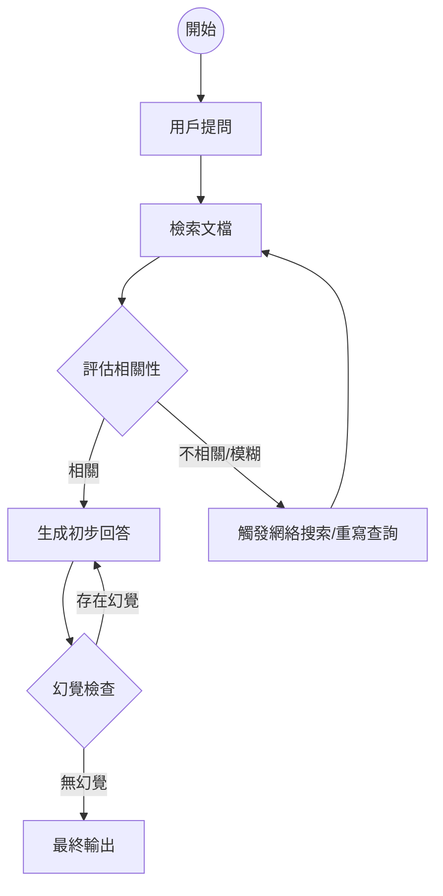

# 

MCP issues detected. Run /mcp list for status.---
title: "從檢索到決策：深度解析 Agentic RAG 的架構演進、自我修正機制與生產級實踐"
date: 2026-05-06T14:00:00+08:00
lastmod: 2026-05-06T14:00:00+08:00
draft: false
weight: 2
categories: ["Tech", "AI"]
tags: ["LLM", "Agentic RAG", "LangGraph", "Machine Learning", "NLP", "Information Retrieval"]
toc:
  enable: true
---

在生成式 AI (Generative AI) 的應用浪潮中，檢索增強生成 (Retrieval-Augmented Generation, RAG) 已成為企業解決大型語言模型 (LLM) 幻覺問題、引入私域知識的標準範式。然而，隨著應用場景從簡單的問答延伸至複雜的邏輯推理與跨文件整合，傳統的「一站式」檢索架構（Naive RAG）逐漸顯露出其侷限性。為了應對低檢索品質、資訊碎片化以及模型無法自我修正等挑戰，**Agentic RAG** 應運而生。這不僅僅是技術上的微調，更是一場從「線性檢索」向「循環決策」的範式轉移。

<!--more-->

## 1. 為什麼我們需要 Agentic RAG？傳統 RAG 的瓶頸

傳統的 Naive RAG 流程通常是線性的：用戶提問 -> 向量搜索 -> 填入 Prompt -> 生成回答。這種模式在處理簡單事實查詢時表現良好，但在面對以下場景時往往會失效：

1.  **檢索噪聲 (Retrieval Noise)**：當向量數據庫返回的 Top-K 文檔與問題不相關或存在干擾資訊時，模型容易被誤導。
2.  **查詢歧義 (Query Ambiguity)**：用戶的問題可能模糊不清，線性流程缺乏反向提問或意圖澄清的機制。
3.  **多跳推理需求 (Multi-hop Reasoning)**：回答一個複雜問題可能需要先檢索 A，根據 A 的結果再去檢索 B。
4.  **缺乏自我審核 (Lack of Self-Correction)**：一旦檢索結果錯誤，模型會基於錯誤事實「一本正經地胡說八道」，無法判斷生成的答案是否符合檢索內容。

Agentic RAG 通過引入「代理 (Agent)」的概念，將 LLM 作為大腦，賦予其決策、規劃與工具調用的能力，使 RAG 流程具備了適應性與智慧。

## 2. Agentic RAG 的核心架構設計

Agentic RAG 的核心在於將靜態的流程轉化為動態的狀態機 (State Machine)。一個完整的 Agentic RAG 架構通常包含以下幾個關鍵組件：

### 2.1 規劃器 (Planner)
規劃器負責解析用戶的複雜意圖，將其分解為多個可執行的子任務。例如，面對「對比 A 產品與 B 產品的性能優缺點」這類問題，規劃器會將其拆解為「檢索 A 性能」、「檢索 B 性能」以及「進行比較」三個步驟。

### 2.2 多樣化工具箱 (Tooling)
Agent 不再僅限於向量檢索。它可以根據需要調用不同的工具：
*   **Vector DB Tool**：用於語義搜索。
*   **Web Search Tool**：用於獲取實時資訊。
*   **SQL/Code Tool**：用於結構化數據運算。
*   **Document Summarizer**：用於處理超長文檔。

### 2.3 評估器與反射機制 (Evaluator & Reflection)
這是 Agentic RAG 的靈魂。每一步生成的結果都會經過評估：
*   **相關性評估**：檢索到的內容是否真的能回答問題？
*   **忠實度評估 (Faithfulness)**：生成的答案是否嚴格遵循檢索內容？
*   **完備性評估**：是否已經收集到了足夠的資訊？

## 3. 實作方向：基於 LangGraph 的循環架構

在實作層面，LangChain 的 LangGraph 提供了一個強大的框架來構建這種有狀態的循環系統。以下是一個典型的 **Corrective RAG (CRAG)** 模式的架構流程：



### 3.1 Python 範例程式碼：構建簡單的 Agent 決策邏輯

以下展示如何使用擬代碼構建一個具備自我修正能力的檢索節點：

```python
from typing import List, TypedDict
from langgraph.graph import StateGraph, END

# 定義狀態
class GraphState(TypedDict):
    question: str
    documents: List[str]
    generation: str
    retry_count: int

def retrieve(state: GraphState):
    print("--- 執行檢索 ---")
    question = state["question"]
    # 假設這是調用向量數據庫
    docs = vector_store.similarity_search(question)
    return {"documents": docs, "question": question}

def grade_documents(state: GraphState):
    print("--- 評估文檔相關性 ---")
    question = state["question"]
    docs = state["documents"]
    
    # 這裡會調用一個輕量級 LLM 來評估每份文檔
    filtered_docs = []
    search_needed = False
    for d in docs:
        score = relevance_scorer.invoke({"question": question, "context": d.page_content})
        if score == "relevant":
            filtered_docs.append(d)
        else:
            search_needed = True
            
    return {"documents": filtered_docs, "question": question, "search_needed": search_needed}

def decide_to_generate(state: GraphState):
    if state["search_needed"]:
        return "web_search"
    else:
        return "generate"

# 構建圖
workflow = StateGraph(GraphState)
workflow.add_node("retrieve", retrieve)
workflow.add_node("grade_documents", grade_documents)
# ... 添加其他節點 ...

workflow.set_entry_point("retrieve")
workflow.add_edge("retrieve", "grade_documents")
workflow.add_conditional_edges(
    "grade_documents",
    decide_to_generate,
    {
        "web_search": "web_search_node",
        "generate": "generate_node",
    },
)
```

## 4. 進階策略：Self-RAG 與多 Agent 協作

當場景更加複雜時，單個 Agent 的壓力會過大。此時我們可以引入更進階的策略：

### 4.1 Self-RAG
Self-RAG 引入了特殊的「反思標記 (Reflection Tokens)」。模型在生成過程中會輸出標記來判斷：
*   `IS_REL`：檢索到的內容是否相關？
*   `IS_SUP`：生成的句子是否得到檢索內容的支持？
*   `IS_USE`：生成的內容是否對用戶有用？

透過精細化的權重控制，Self-RAG 能在保持事實準確性的同時，極大提升語言的自然度。

### 4.2 多 Agent 辯論 (Multi-Agent Debate)
在法律或醫療等高準確性要求的領域，可以部署兩個不同的 Agent：
1.  **Proposer Agent**：負責根據檢索內容生成答案。
2.  **Critic Agent**：負責挑戰 Proposer 的觀點，尋找邏輯漏洞或檢索盲點。
兩者通過多輪對話達成共識，這能有效過濾掉 90% 以上的幻覺內容。

## 5. 生產級實踐中的挑戰與解決方案

雖然 Agentic RAG 強大，但在落地過程中也會遇到不少硬傷：

### 5.1 延遲 (Latency) 的噩夢
多次 LLM 調用和循環檢索會導致首字生成時間 (TTFT) 大幅增加。
*   **解決方案**：
    *   **並行化 (Parallelism)**：在規劃階段，同時進行多個子查詢的檢索。
    *   **模型路由 (Model Routing)**：使用輕量級模型（如 GPT-4o-mini 或 Llama-3-8B）進行「評估相關性」等中間步驟，僅在最終生成時使用旗艦級模型。

### 5.2 狀態爆炸與死循環
如果 Agent 判斷檢索結果始終不相關，可能會陷入無限檢索的死循環。
*   **解決方案**：
    *   **設置硬上限 (Hard Limits)**：限制最大迭代次數（如 Max Loops = 3）。
    *   **降級策略**：當多次檢索失敗時，主動告知用戶「目前資料庫中缺乏相關資訊」，而非持續嘗試。

### 5.3 評估難題
傳統的 ROUGE 或 BLEU 指標無法衡量 Agent 的決策好壞。
*   **解決方案**：
    *   採用 **RAGAS** 或 **TruLens** 框架。
    *   重點監控「檢索命中率」、「幻覺率」以及「Agent 路徑成功率」。

## 6. 總結：邁向自適應 AI 系統

Agentic RAG 的興起，代表了我們對大語言模型運用方式的進化：從單純的「預測下一個 Token」轉變為「作為系統調度中樞」。透過自我反思、動態規劃與工具調用，Agentic RAG 為解決 AI 的可靠性問題提供了一套嚴謹的工程化框架。

對於開發者而言，未來的核心競爭力將不在於如何微調模型，而在於如何設計一套精密的「狀態機」與「反射機制」。在即將到來的 Agentic Era，能理解業務邊界並將其轉化為 Agent 邏輯的工程師，將會是這場 AI 革命中真正的架構師。

---
**參考文獻與推薦閱讀：**
*   *LangGraph Documentation - Adaptive RAG*
*   *Self-RAG: Learning to Retrieve, Generate, and Critique through Self-Reflection (ICLR 2024)*
*   *Corrective Retrieval-Augmented Generation (CRAG) Paper*
